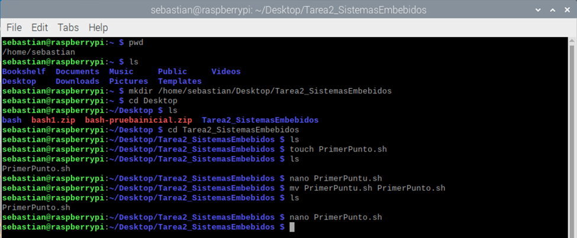

Tarea 2. Sistemas embebidos.
Presentado por: Sebastián Felipe García Rojas

## Creación de carpeta, de archivo con extensión .sh y uso del editor nano. 
 
**1. Realizar un script que imprima los argumentos de entrada separados por coma sin importar cuántos sean, si no entran argumentos no se imprime nada.**

Código realizado en Bash

Realización de prueba funcional:

Resultado ingresando cualquier número de argumentos:
 
Resultado cuando no se ingresan argumentos:
 

2. Realizar un script que muestre en pantalla cuantos usuarios hay en el sistemas “Totales de usuarios con cuenta sin importar si esta autenticado en el momento o no. 

Código realizado en Bash
 

Realización de prueba funcional:

Se realiza una primer prueba. Se obtienen dos usuarios: nobody y sebastian
sebastian es un usuario personal, mientras que nobody es un usuario predeterminado en sistemas UNIX, en este código se decidió mantener este usuario.

 

Para la segunda prueba, se realiza el procedimiento para la creación de un nuevo usuario. Se puede observar como este nuevo usuario se ve reflejado al momento de aplicar este script.

 

3. Realizar un script que muestre cuantos puertos seriales “/dev/ttyS” hay en el sistema. Averigüe que otro nombre pueden tener los seriales de su máquina, como adaptadores USB a serial. 

En primer lugar, se enlistan todos los puertos seriales presentes en el sistema. 
 

Cuando se conecta un adaptador USB a serie a la raspberry Pi u otro sistema Linux, es posible que el dispositivo se identifique con nombres como ‘/dev/ttyUSB0’, ‘/dev/ttyUSB1’, etc. Esto puede depender de cuántos dispositivos seriales estén conectados y en qué orden se detecten. 

Otro tipos de puerto serial:

1. Puerto Bluetooth: Los dispositivos Bluetooth pueden estar disponibles como puertos seriales virtuales. Los nombres de dispositivos para puertos seriales Bluetooth pueden ser similares a ‘/dev/rfcomm0’.

2. Puertos FPGA o Microcontroladores: Algunas placas de desarrollo FPGA o microcontroladores pueden crear puertos seriales virtuales para la comunicación con la computadora host. Estos puertos podrían tener nombres como ‘/dev/ttyACM0’ o ‘/dev/ttyAMA1’

3. Puertos de Módems 3G/4G: Algunos módems 3G/4G pueden presentarse como puertos seriales virtuales para facilitar la comunicación y la configuración. Los nombres de dispositivos podrían ser como ‘/dev/ttyUSB0’ o ‘/dev/ttyACM0’.

4. Emuladores de Terminal: Algunos emuladores de terminal, como los utilizados para la conexión a dispositivos de red o sistemas remotos, también pueden crear puertos seriales virtuales. Los nombres de dispositivos pueden variar dependiendo del software que se esté utilizando. . 

Código realizado en Bash

 

Realización de prueba funcional:

El resultado de la prueba funcional se comprueba respecto a la lista de puertos seriales sacadas con el comando ls, que en este caso es 1.

 

4. Realizar un script que verifique si un único argumento de entrada es numérico. 

El siguiente código verifica que el número de argumentos ingresado $# sea uno para cumplir con la condición. Si la condición se cumple, se procede a validar si la expresión corresponde a un valor numérico. 

Código realizado en Bash.
 

Pruebas realizadas.

El protocolo de pruebas consiste en ingresar todas las opciones posible: Una sola letra como carácter, una palabra como carácter, múltiples letras, múltiples números, un número de un solo dígito y un número de varios dígitos. 

 

5. Realizar un script llamado ‘resta.sh’ que realice la resta de 2 argumentos introducidos (tendrá que poder operar números decimales, como 2.2-3) puede usar el script anterior para depurar las entradas.

Para depurar los datos, se usó parte de la solución anterior para crear la función is_number() que verifica que los argumentos sean numéricos retornando valores booleanos.

 

Pruebas realizadas

 

6. Realizar un script llamado ‘multiplica’ que multiplique los 2 argumentos introducidos (tendrá que poder multiplicar números decimales, como 2.2*3).

Este script se tomó del script anterior, con la única diferencia de que se le cambió la operación.

 

Pruebas realizadas:

 

7. En la carpeta anexa hay varios archivos de texto en formato separado por comas, cree un script que una (anexando “append”) todos los archivos con la extensión .csv en un archivo llamado union.csv

Se exportan los archivos anexos utilizando scp desde el computador personal hacia la tarjeta con el siguiente comando. 

 

Se descomprime el archivo desde la consola de comandos del sistema operativo de la tarjeta para poder acceder a los archivos dentro del .zip

 

Para la realización de este script se utiliza el comando cat acompañado con el comodín *.
 

Prueba realizada. 

Se ingresa al archivo .csv y se observa el número total de líneas escritas. 

 

Se utiliza el siguiente comando para contabilizar el número de líneas totales de todos los archivos .csv dentro de la carpeta anexa.

 

El número de líneas totales corresponde al número de líneas del archivo con todos los archivos .csv anexos .

8. Cree un script que comprima los 2 directorios de entrada por argumento “A” y “B” utilizando el algoritmo “gzip” en un único archivo en el home del usuario llamado “A_B.tar.gz”.

Se realiza el siguiente programa para la compresión de los archivos. 

 

Pruebas realizadas. Se ingresan la dirección absoluta de dos directorios, la salida almacena en un archivo comprimido en la dirección del usuario, en este caso (sebastian).

 

Para verificar este resultado, se enlistan los archivos del directorio en el que se ubica el archivo de salida. 

 

 

9. Lea la documentación de $mktemp úselo para crear un script que guarde en un archivo la hora actual de la máquina. Compruebe usted mismo bajo que condiciones se borra el archivo de salida que acaba de crear e.g. reinicio o similar. 

 

Se verifica la existencia del archivo temporal ubicado en la carpera por defecto /tmp.

 

10. Cree un script que tome todos los archivos .csv anexos y los renombre así: 
ARCHIVO_###_AAAAMMDD-HH:MM:SS_consecutivo.scv, donde ### es un número aleatorio de 3 cifras, y consecutivo es un número consecutivo para evitar cualquier duplicidad, AAAAMMDD-HH:MM:SS es la fecha de cuando se corre el scrip y es la misma para todos los archivos. 

. 
 

Ejecución del código.

 

Verificación de los resultados. 
 

11. Cree un script que de informe en pantalla al usuario de cuanto tamaño en MB esta ocupando su usuario en /home/$USER

Script realizado
 
Ejecución del código.

 

12. Cree un script que cree un archivo de reporte con datos básicos del hardware de su sistema actual (Averigüe usted mismo cuales son fáciles de obtener y cree usted vale la pena) y repórtelos en un archivo separado por comas. Tenga cuidado con este último script de no causar errores en su máquina. 

Código realizado.
 
Información del sistema después de haber ejecutado el script.

 

Conclusiones

•	El lenguaje de programación Bash es una herramienta poderosa, especialmente al momento de automatizar procesos dentro del sistema operativo, que de otra forma serían arduos de realizar de forma manual

•	Bash permite el análisis y manejo de datos en alto nivel, lo que facilita la depuración de archivos con miles e incluso millones de datos. Aplicación importante en Machine Learning, Análisis de datos u otras áreas.

•	 Con este lenguaje de programación se puede realizar todo tipo de manipulación de archivos, incluso con grandes cantidades de archivos y de forma simultánea, por ejemplo: Crear, copiar, mover o eliminar. Esto de otra manera resultaría bastante tedioso.

•	El uso de este lenguaje de programación da una base sólida en el uso de la consola de comandos. 
